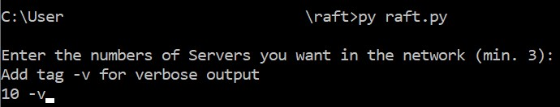
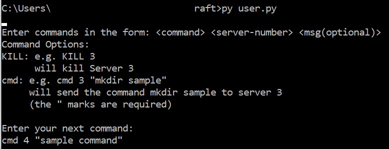
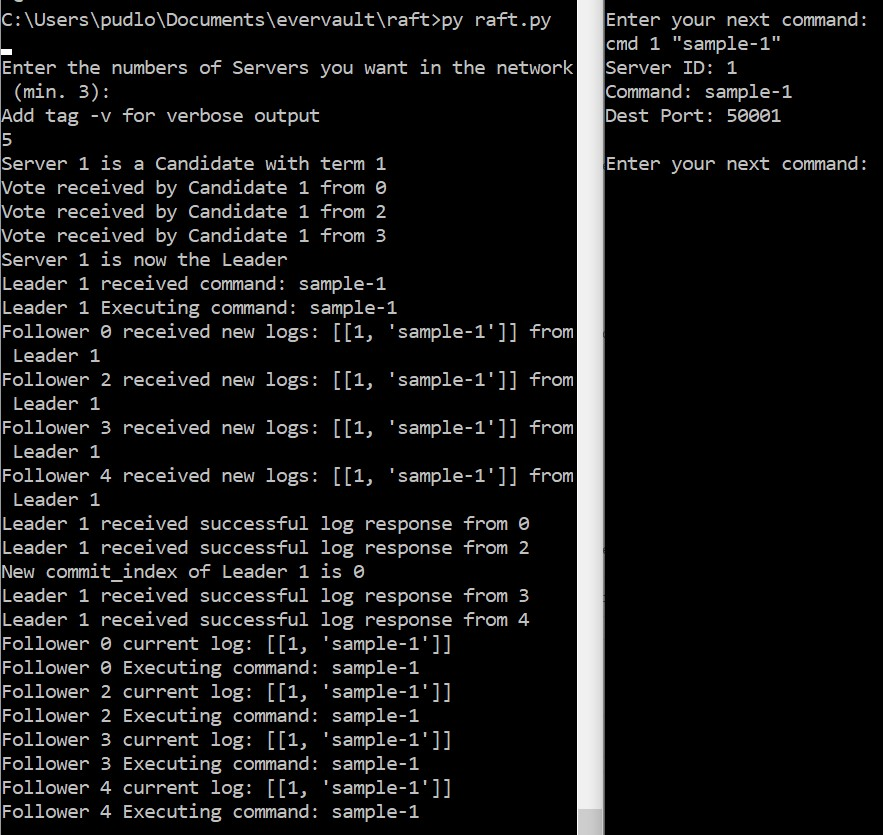
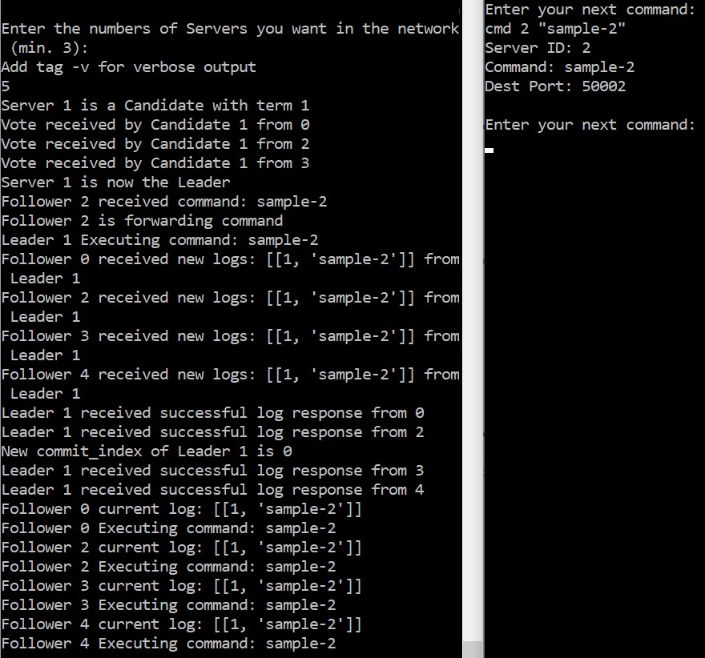
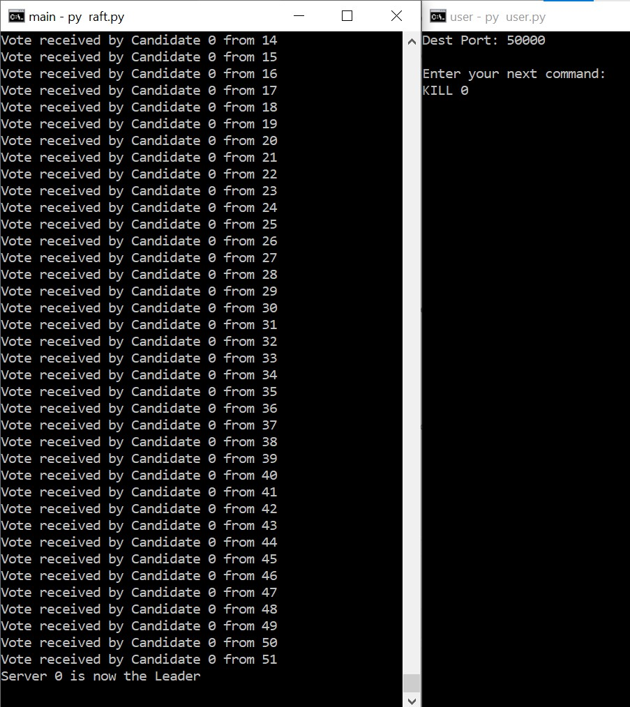
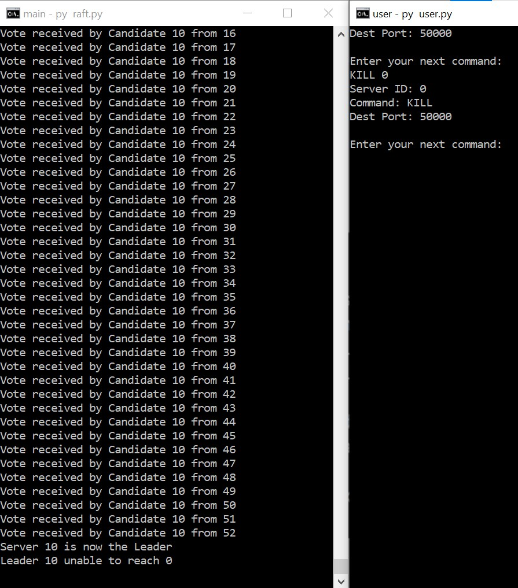

# Raft Implementation and Simulation in Python

## What is Raft?
[Raft](https://en.wikipedia.org/wiki/Raft_(algorithm)) is a consensus algorithm designed for simplicity. It was motivated by the difficulty of understanding complex
consensus algorithms such as the [Paxos](https://en.wikipedia.org/wiki/Paxos_(computer_science)) consensus algorithm. This implementation was based solely off
this [paper](https://raft.github.io/raft.pdf) by Diego Ongaro.

## My Implementation
I chose to simulate a network with different 'server' processes communicating with each other across ports. The bulk of the code is in [server.py](./server.py)

## Running the Simulator
1. Clone this repository

```
git clone https://github.com/davidnugent2425/raft.git
```

2. Install the required packages
```
pip install -r requirements.txt
```

3. Open 2 Terminals

* One for running the server network
* One for manipulating and sending messages to the network.

4. Run the raft script

```
py raft.py
```

5. Enter the size of the network and optionally request verbose output



6. Run the user script (second terminal)

```
py user.py
```

7. Enter commands and watch the effect they have on the netork



## Possible improvements

* use transport libraries with better abstractions
* visualisations of the network
* more concurrency
* functionality to simulate more issues that could occur in real networks

## Extra Comments

* it has worked well for me up to 100 nodes, then I start to have more socket issues.
* some more unit testing would probably be good.
* if there are 3 nodes in the network, and one is killed, neither of the remaining nodes will win the leader election. There could be more code added for edge cases like this, or when the network size < 3.
* the verbose output shows the inner workings of the algorithm, and is interesting to view when using a small network size.
* the default starting port is 50000. I am not sure if this is optimal or not.

## Sample Outputs

### Leader Command Distribution

Sending a command to a leader (these screenshots also display the initial leader election)



### Follower Command Forwarding

If a command is sent to a follower, they will forward it to the leader by broadcasting it on the network



### Killing the Leader in a network of 100 nodes

Before:



After:


